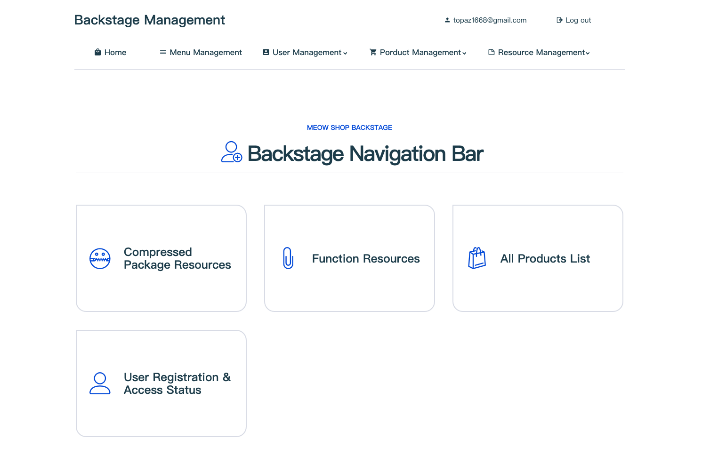

A shopping websites that sell virtual items made by [Topaz](https://topaz1618.github.io/about)([Website](http://topazaws.com/)|[Blog](https://topaz1618.github.io/blog/))

[Chinese README](https://github.com/Topaz1618/MeowShop/blob/master/README_CN.md)


# Features:
- User registration/login/logout
- Support member recharge
- Merchandise
    - Merchandise discount
    - Support favorite Product
    - Support tags to prompt discounted products and new products
    - Support product classification filtering
    - Price sorting
    - Online payments

- Order section
    - Basic order information display: third-party order number, payment time, discount amount, actual payment amoun
    - Order deletion
    - Repay unclosed orders
    - Timeout orders are automatically closed

- Backstage management
    - Product release
    - Product modification: Price, discount, description
    - Product deletion

- Others
    - New users automatically gift members


# Environment
- Python3
- Tornado
- Ubuntu16.04/ Mac OS
- Mysql


## Requirements
- tornado >= 6.1
- PyJWT == 1.7.1

## Installation (Ubuntu & Mac OS)
1. Download MeowFile
```
 git clone git@github.com:Topaz1618/MeowShop.git
```

2. Install dependencies
```
 pip install -r requirements.txt
```

3. Create database & Generate admin user
```
 python models.py
```

4. Modify configuration
```
 $ cd MeowFile
 $ vim config.py
 USERNAME = "root"
 PASSWORD = "123456"
 HOST = "127.0.0.1"
 PORT = "3306"
 DATABASE = "XXDB"

 DEBUG_PAY = True                               // Use Sandbox environment
 APPID = ""                                     // App ID
 APP_NOTIFY_URL = "https://www.xx.com/update_order"   // Callback
 ALIPAY_PUBLIC_KEY = "public_key.pem"           // Public Key
 ALIPAY_PRIVATE_KEY = "private_key.pem"         // Private key
```

## Run
```
 python apps.py
```


## Alipay (Payment method use in Meow Shop)

- Sandbox environment web-side payment (used in this project).

- Web payment in production environment,need to upload business license, only for enterprise users. You can click to view [Create Web Payment Application](https://opendocs.alipay.com/open/270/01didh).

    The payment process of the production environment is the same as that of the sandbox environment, no need to modify the code, just modify the following configuration items.
    ```
      DEBUG_PAY = False          // Set 'DEBUG_PAY = False'  in the production environment
      APPID = "2021000116669851" // Set APPID
    ```

## Alipay sandbox environment

- Download
   Use the Android mobile to scan the QR code sandbox wallet below.

   

- Log in to the alipay sandbox app

    Alipay sandbox default buyer account
    ```
     ACCOUNT： vnocjr9471@sandbox.com

     PASSWORD： 111111
    ```

Click to view [Alipay Sandbox](https://openhome.alipay.com/platform/appDaily.htm)


## Screenshots

## 【Store】


## 【Payment】


## 【Backstage1】


## 【Backstage2】


## 【所有页面浏览】


[查看更多 ffmpeg](https://topaz1618.github.io/about)


[Topaz](https://topaz1618.github.io/about)([Website](http://topazaws.com/)|[Blog](https://topaz1618.github.io/blog/)

## License
Licensed under the MIT license