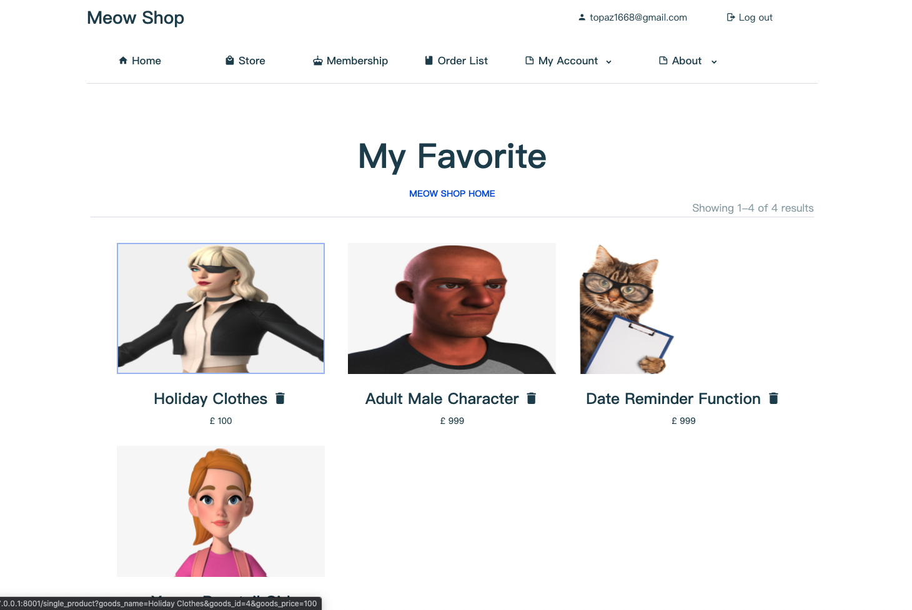

A shopping websites that sell virtual items made by [Topaz](https://topaz1618.github.io/about)|[Website](http://topazaws.com/)|[Blog](https://topaz1618.github.io/blog/)

[Chinese README](https://github.com/Topaz1618/MeowShop/blob/master/README_CN.md)


# Features:
    - User registration/login/logout
    - Support member recharge
    - Merchandise
        - Merchandise discount
        - Support favorite Product
        - Support tags to prompt discounted products and new products
        - Support product classification filtering
        - Price sorting
        - Online payments

    - Order section
        - Basic order information display: third-party order number, payment time, discount amount, actual payment amoun
        - Order deletion
        - Repay unclosed orders
        - Timeout orders are automatically closed

    - Backstage management
        - Product release
        - Product modification: Price, discount, description
        - Product deletion

    - Others
        - New users automatically gift members


# Environment
    - Python3
    - Tornado
    - Ubuntu16.04/ Mac OS
    - Mysql


## Requirements
- tornado >= 6.1
- PyJWT == 1.7.1

## Installation (Ubuntu & Mac OS)
1. Download MeowFile
```
    $ git clone git@github.com:Topaz1618/MeowShop.git
```

2. Install dependencies
```
    pip install -r requirements.txt
```

3. Create database & Generate admin user
```
    python models.py
```

4. Modify configuration
```
    $ cd MeowFile
    $ vim config.py
    USERNAME = "root"
    PASSWORD = "123456"
    HOST = "127.0.0.1"
    PORT = "3306"
    DATABASE = "aaaDB"

    DEBUG_PAY = True    // Open sandbox test (Set to false in the production environment)
    APPID = "2021000116669851"  // Alipay App ID
    APP_NOTIFY_URL = "https://www.123.com/update_order"   // Callback URL
    ALIPAY_PUBLIC_KEY_PATH = "alipay_public_key.pem"    // Alipay Public Key
    APP_PRIVATE_KEY_PATH = "app_private_key.pem"        // Private key
```

## Run
```
    python apps.py
```


## About Alipay
    - Sandbox environment web-side payment (used in this project)

    - Web payment in production environment,need to upload business license, only for enterprise users.
        [Click to apply for company account activation](https://opendocs.alipay.com/open/270/01didh)

        The payment process of the production environment is the same as that of the sandbox environment, no need to modify the code, just modify the following configuration items
        ```
            DEBUG_PAY = False    // Set to false in the production environment
            APPID = "2021000116669851" // Set APPID
        ```

## Alipay sandbox environment
[Alipay sandbox introduction](https://openhome.alipay.com/platform/appDaily.htm)


1. Download
   Use the Android mobile browser to scan the QR code sandbox wallet below
   

2. Log in to the Alipay sandbox APP (Alipay sandbox default buyer account)
```
    Account：vnocjr9471@sandbox.com
    Password：111111
```


## Screenshots

## 【商店】


## 【我的收藏】


## 【订单页】


## 【付款】


## 【后台】


## 【所有页面浏览】


[查看更多 ffmpeg](https://topaz1618.github.io/about)


[Topaz](https://topaz1618.github.io/about)|[Website](http://topazaws.com/)|[Blog](https://topaz1618.github.io/blog/)

## License
Licensed under the MIT license