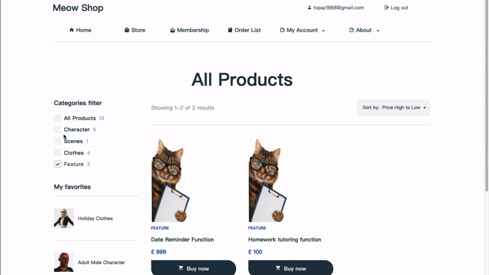
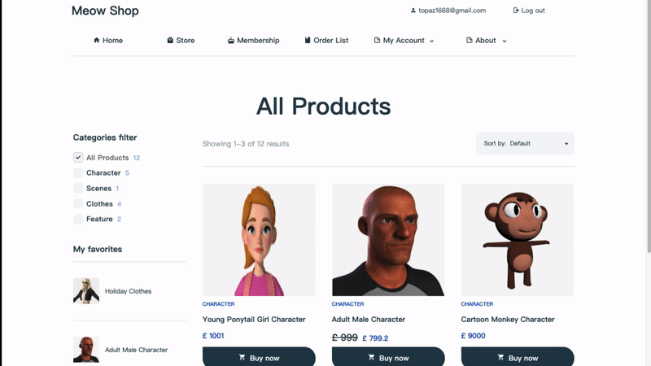
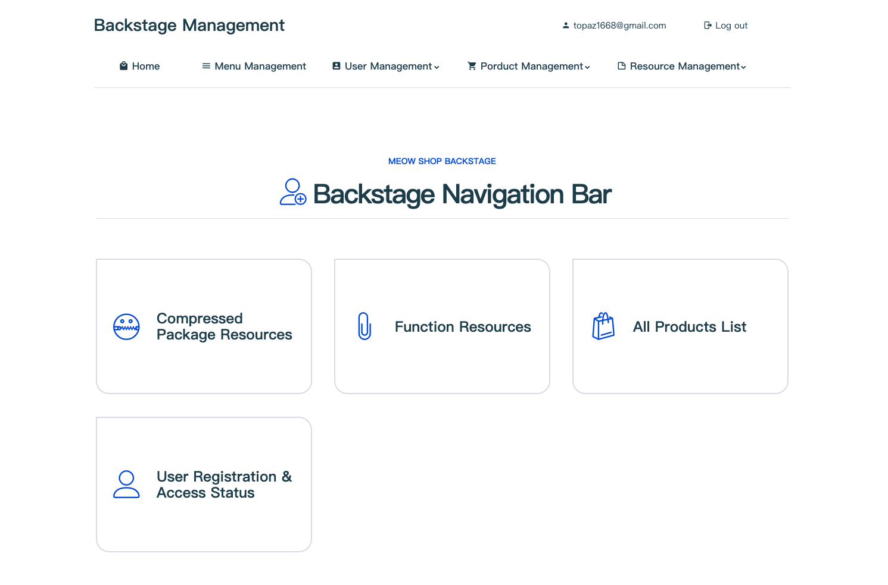
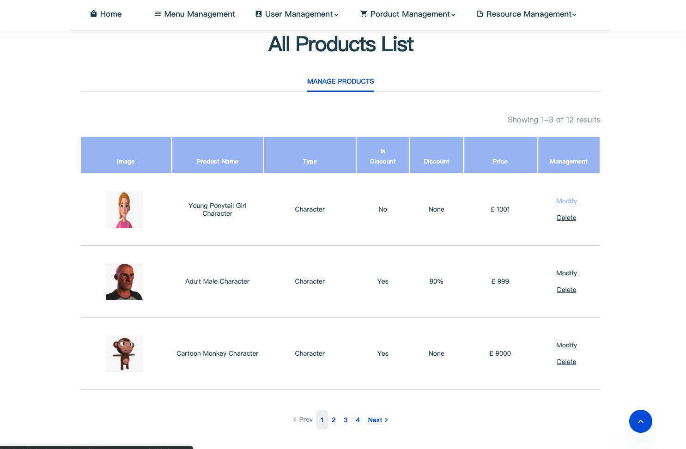

A shopping websites that sell virtual items made by [Topaz](https://topaz1618.github.io/about)|[Website](http://topazaws.com/)|[Blog](https://topaz1618.github.io/blog/)

[英文 README](https://github.com/Topaz1618/MeowShop/blob/master/README.md)


# Features:
- 用户注册/登录/登出
- 新用户注册赠送会员

- 商品
    - 收藏商品
    - 商品打折
    - 促销商品，新上架商品展示
    - 商品基础信息显示
    - 商品分类过滤
    - 商品排序
    - 在线支付

- 订单部分
    - 订单列表
    - 订单基本信息显示: 第三方单号, 付款时间, 折扣金额，实际支付金额
    - 订单删除
    - 超时订单自动关闭

- 后台管理
    - 商品发布
    - 商品修改(价格，折扣)
    - 商品删除

- 会员充值


# Environment
- Python3
- Tornado
- Ubuntu16.04/ Mac OS
- Mysql


## Requirements
- tornado >= 6.1
- PyJWT == 1.7.1


1. 下载 MeowFile
```
 git clone git@github.com:Topaz1618/MeowShop.git
```

2. 安装依赖项
```
 pip install -r requirements.txt
```

3. 创建数据库表
```
 python models.py
```

4. 修改配置
```
 $ cd MeowFile
 $ vim config.py
 USERNAME = "root"
 PASSWORD = "123456"
 HOST = "127.0.0.1"
 PORT = "3306"
 DATABASE = "XXDB"

 DEBUG_PAY = True                               // 使用杀向环境
 APPID = ""                                     // App ID
 APP_NOTIFY_URL = "https://www.xx.com/update_order"   // Callback
 ALIPAY_PUBLIC_KEY = "public_key.pem"           // Public Key
 ALIPAY_PRIVATE_KEY = "private_key.pem"         // Private key
```

## 运行
```
 python apps.py
```


## Alipay (Meow Shop 使用支付方式)

- 沙盒环境网页端支付（本项目使用）

- 生产环境网页支付，需上传营业执照，仅供企业用户使用。您可以点击查看 [企业网页支付应用](https://opendocs.alipay.com/open/270/01didh).

    生产环境的支付过程与沙盒环境的支付过程相同，无需修改代码，只需修改以下配置项即可
    ```
      DEBUG_PAY = False          // Set 'DEBUG_PAY = False'  in the production environment
      APPID = "2021000116669851" // Set APPID
    ```

## 支付宝沙盒环境

- 下载
   使用安卓手机扫描下方二维码沙盒钱包

   

- 登录支付宝沙盒 APP

    支付宝沙盒默认账号
    ```
     ACCOUNT： vnocjr9471@sandbox.com

     PASSWORD： 111111
    ```

Click to view [Alipay Sandbox](https://openhome.alipay.com/platform/appDaily.htm)


## Screenshots

## 【Store1】


## 【Store2】


## 【Payment】


## 【Backstage1】


## 【Backstage2】


## License
Licensed under the MIT license