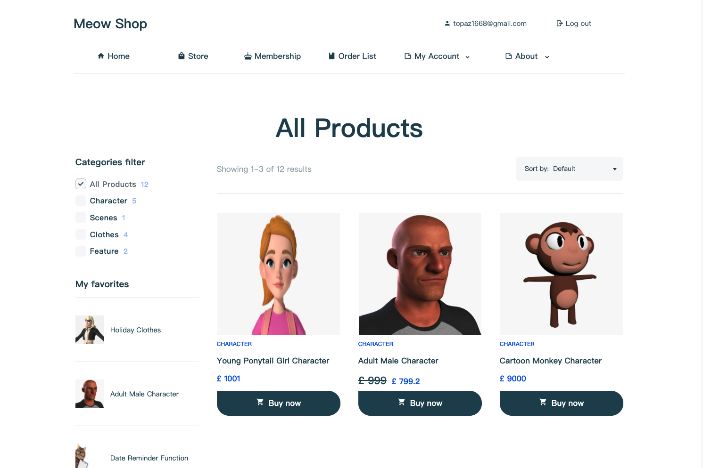
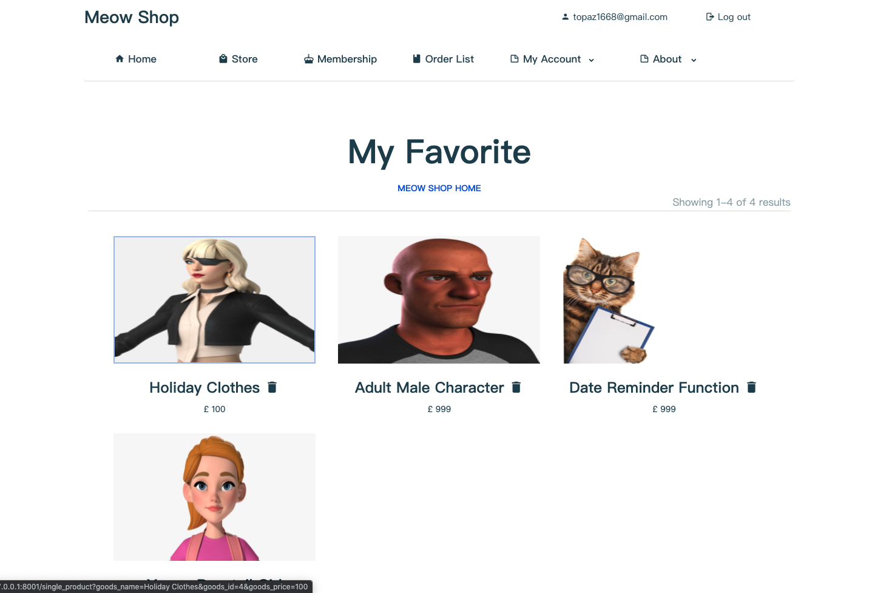
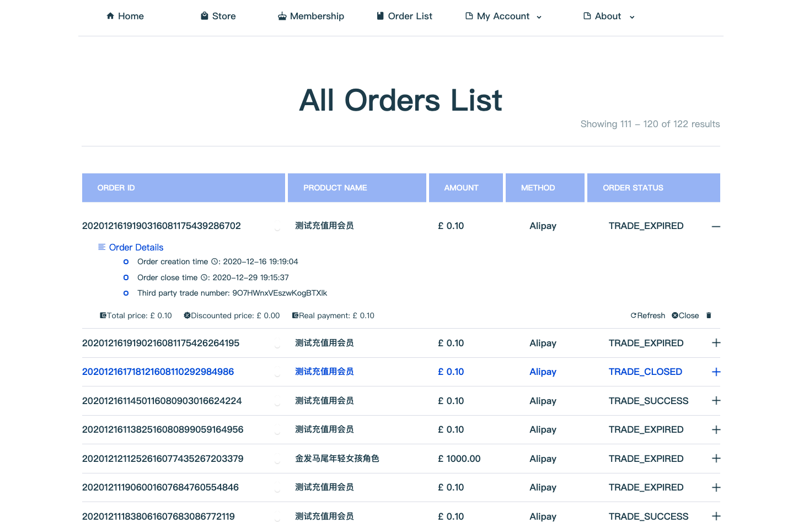

A shopping websites that sell virtual items made by [Topaz](https://topaz1618.github.io/about)|[Website](http://topazaws.com/)|[Blog](https://topaz1618.github.io/blog/)

[英文 README](https://github.com/Topaz1618/MeowShop/blob/master/README.md)


# Features:
    - 用户注册/登录/登出
    - 新用户注册赠送会员

    - 商品
        - 收藏商品
        - 商品打折
        - 促销商品，新上架商品展示
        - 商品基础信息显示
        - 商品分类过滤
        - 商品排序
        - 在线支付

    - 订单部分
        - 订单列表
        - 订单基本信息显示: 第三方单号, 付款时间, 折扣金额，实际支付金额
        - 订单删除
        - 超时订单自动关闭

    - 后台管理
        - 商品发布
        - 商品修改(价格，折扣)
        - 商品删除

    - 会员充值


# Environment
    - Python3
    - Tornado
    - Ubuntu16.04/ Mac OS
    - Mysql


## Requirements
- tornado >= 6.1
- PyJWT == 1.7.1

## Installation (Ubuntu & Mac OS)
1. Download MeowFile
```
    $ git clone git@github.com:Topaz1618/MeowShop.git
```

2. Install dependencies
```
    pip install -r requirements.txt
```

3. Create database & Generate admin user
```
    python models.py
```

4. Modify configuration
```
    $ cd MeowFile
    $ vim config.py
    USERNAME = "root"
    PASSWORD = "123456"
    HOST = "127.0.0.1"
    PORT = "3306"
    DATABASE = "aaaDB"

    DEBUG_PAY = True    // Open sandbox test (Set to false in the production environment)
    APPID = "2021000116669851"  // Alipay App ID
    APP_NOTIFY_URL = "https://www.123.com/update_order"   // Callback URL
    ALIPAY_PUBLIC_KEY_PATH = "alipay_public_key.pem"    // Alipay Public Key
    APP_PRIVATE_KEY_PATH = "app_private_key.pem"        // Private key
```

## Run
```
    python apps.py
```


## 支付宝
    - 生产环境网页端 (仅限企业用户，需提供营业许可证等)，开通点击 https://opendocs.alipay.com/open/270/01didh
        生产环境流程相同，只需修改配置文件中以下项.
        ```
            DEBUG_PAY = False    // Set to false in the production environment
            APPID = "2021000116669851" // Set APPID
        ```

    - 沙箱环境网页端 (本项目使用)


## 沙箱环境介绍: https://openhome.alipay.com/platform/appDaily.htm

1. 下载
    使用Android手机浏览器扫描下面的二维码沙箱钱包
    

2. 使用如下买家账号登录
    买家账号：vnocjr9471@sandbox.com
    密码：111111


## Screenshots

## 【商店】


## 【我的收藏】


## 【订单页】



## 【付款】


## 【后台】


## 【所有页面浏览】


[查看更多 ffmpeg](https://topaz1618.github.io/about)


[Topaz](https://topaz1618.github.io/about)|[Website](http://topazaws.com/)|[Blog](https://topaz1618.github.io/blog/)

## License
Licensed under the MIT license